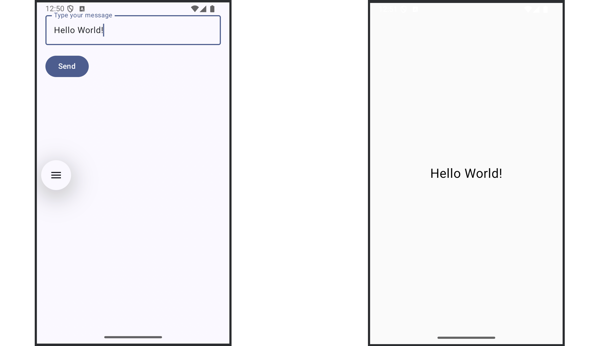

# MEIC/METI 2024/2025  
## Mobile and Ubiquitous Computing  
### Lab Guide 1  
## Introduction to Android and Kotlin

---

### Objectives

This first lab introduces students to Android application development using **Android Studio Meerkat (2024.3.1 Patch 2)** and **Kotlin**.  
By the end of this lab, students should be able to:

- Understand the structure of an Android project using Kotlin.
- Set up and run an app on an emulator or a physical device.
- Create and navigate between activities.
- Build simple UI layouts using Jetpack Compose.
- Handle user input and basic events.
- Use Logcat and Android Studio's debugger.
- Build a simple TODO list app.

This lab is designed for **autonomous learning**: follow the instructions, explore the official documentation when needed, and work at your own pace. You can discuss with colleagues, but each student must complete their own work.

### Material

- [Class Slides](slides.pdf)

---

# Exercise 1 – Hello Android (Two Activities)

In this exercise, you will build a basic Android application composed of two activities:

The first activity, shown when the app starts, will contain a text input and a "Send" button. When the user types a string and presses the button, a second activity will launch, displaying the message that was entered.

**Figure 1**: Activities implemented by the Hello Android app.  

The exercise is broken down into:

- **1.1:** Creating the project and understanding its structure
- **1.2:** Testing the app on the emulator or physical device
- **1.3:** Building the second activity and connecting it to the first

---

## 1.1 Create a New Android Project

1. Open Android Studio.
2. Select **"New Project" > "Empty Activity"**.
3. Set the following:
   - **Name**: `HelloAndroid`
   - **Language**: Kotlin
   - **Minimum SDK**: API 24 or higher
4. Click **Finish** to create the project.

### a. Explore the Project Structure

Navigate through the project and describe the role of:

- `app/src/main/java/.../MainActivity.kt`
- `app/src/main/AndroidManifest.xml`
- `build.gradle.kts` (project and module level)

(Hint: Read ["Projects overview"](https://developer.android.com/studio/projects)).

### b. Managing the Emulator

To run your app on an Android emulator:

1. Open **Device Manager**.
2. Click **Create Device**, choose a phone model (e.g., Pixel 6).
3. Choose a system image (e.g., API 34) and click Next.
4. Configure any settings and click Finish.
5. Start the emulator.

### c. Running on a Physical Device (Optional)

1. Connect your Android device via USB.
2. Enable **Developer Options**:
   - Settings > About Phone > Tap "Build Number" seven times.
   - Settings > System > Developer Options > Enable **USB Debugging**.
3. Your device should appear in the Run dropdown.

**Reference**:  
- [Create your first Android app](https://developer.android.com/codelabs/basic-android-kotlin-compose-first-app)  
- [Run apps on a hardware device](https://developer.android.com/studio/run/device)

---
